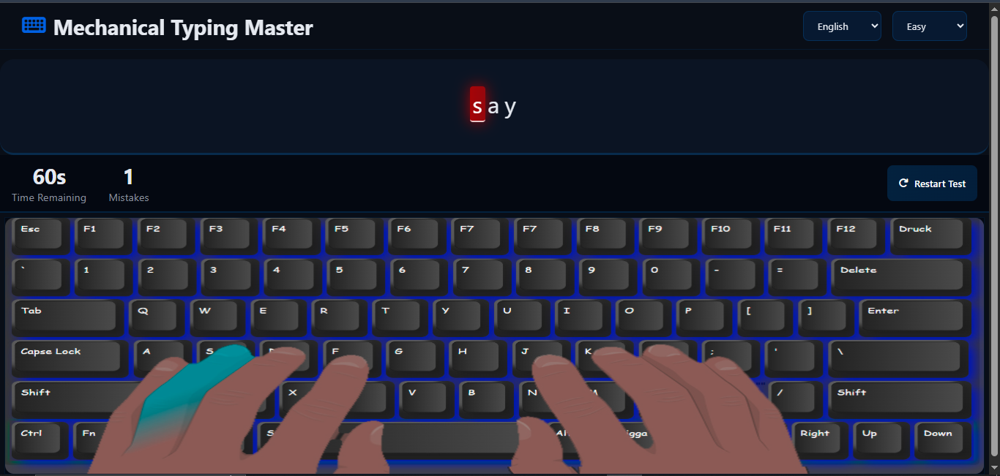
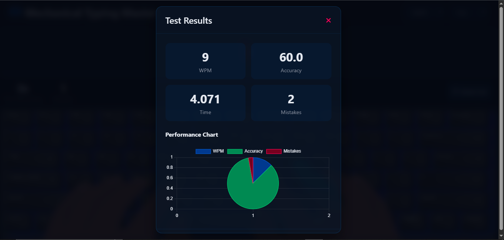

# Mechanical Typing Master

**Mechanical Typing Master** is a cozy and functional typing game designed to teach you professional typing skills in English, Persian, coding, or numbers. Practice using all 10 fingers across three difficulty levels (Easy, Medium, Hard) and watch your progress in real-time with statistics and charts. The game features a realistic mechanical keyboard display, guiding you visually with both hands and finger placements, making learning both effective and enjoyable.

## ✨ Features

- **Multilingual & Multi-mode**: Practice typing in English, Persian, coding symbols, or numbers.
- **Three Difficulty Levels**: Easy, Medium, and Hard modes to suit your progress.
- **10-Finger Guidance**: On-screen mechanical keyboard shows which finger should press each key.
- **Dark Mode**: Stylish, eye-friendly dark mode theme.
- **Cozy Design**: Enjoy a welcoming interface designed for long, comfortable practice sessions.
- **Performance Tracking**: See your WPM (words per minute), accuracy, and mistakes as text and in interactive charts powered by Chart.js.
- **Instant Start**: Just open the site and press any key to begin!
- **Simple Navigation**: Change language and difficulty easily from the top navigation bar.
- **Accessible**: Play directly online at [mechanical-typing-master.netlify.app](https://mechanical-typing-master.netlify.app) or download the files from GitHub.

## 🚀 Getting Started

**Online:**  
Just visit [mechanical-typing-master.netlify.app](https://mechanical-typing-master.netlify.app) and start typing!

**Local Installation:**

1. Download or clone this repository:
   ```bash
   git clone https://github.com/amirmahdi1390/Mechanical-Typing-Master.git
   ```
2. Open `index.html` in your browser.

No additional setup or dependencies required.

## 🕹️ How to Use

1. Enter the game (either online or by opening `index.html`).
2. Press any key to start.
3. Use the navigation bar at the top to switch languages or levels at any time.
4. Follow the mechanical keyboard at the bottom to see which finger should press each key.
5. View your statistics and progress in real time, including mistakes, WPM, and accuracy (also visualized in charts).

## 📊 Technologies Used

- **HTML**
- **CSS**
- **JavaScript**
- **Chart.js**

## 🎨 here are some pictures of the game






## 👤 Author

Created by Amir.Mahdi Sultani => [@amirmahdi1390](https://github.com/amirmahdi1390).  
No external contributors—built from scratch!

## 🆓 License

No license. All users are free to use and enjoy this project.

## 👥 Who Is It For?

- Programmers
- Typing enthusiasts
- Students
- Anyone eager to improve their typing speed and accuracy

## 🔮 Roadmap

> **A better version built with React, featuring a full learning course, enhanced features, and more is coming soon! Stay tuned.**

---

Enjoy your cozy journey to becoming a typing master with Mechanical Typing Master!
